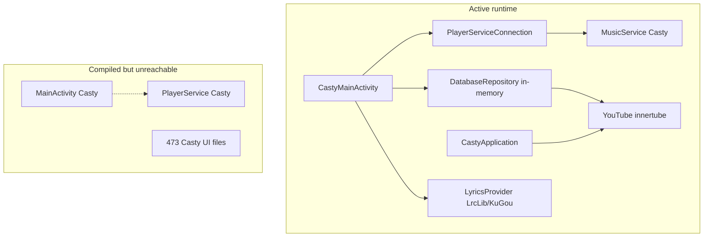

# Casty — Full-stack integration & codebase audit

**Date:** 2026-05-24  
**APK analyzed:** `composeApp/build/outputs/apk/full/debug/casty-full-debug.apk` (~**57.4 MB**)  
**Persona:** Ultra (streaming-product engineering bar: Spotify / YouTube Music / Apple Music)  
**Scope:** `composeApp` Android, `innertube`, Casty playback (`com.casty.music.backend`), Casty UI (`com.casty.music`), legacy Casty (`it.fast4x.Casty`)

---

## Executive summary

| Area | Score | Summary |
|------|-------|---------|
| **Core music path** | 🟢 Strong | Home, search, library, playlist/album/artist, playback, queue, offline cache, account login → **Casty `MusicService` + `innertube`** |
| **UI ↔ backend alignment** | 🟡 Mixed | Several screens are **visual mocks** (podcast, audiobook, about song, cast devices); settings **do not reach the player** |
| **Casty backend utilization** | 🟡 ~35% of innertube | Playback stack well used; **large innertube API surface unused** (podcasts, history, charts, mood, suggestions, library mutations) |
| **Lyrics** | 🟢 Working (not Casty UI) | **`LyricsProvider`** → LrcLib + KuGou; Casty `Lyrics.kt` is **dead** in Casty runtime |
| **APK / dead code** | 🔴 Critical | **~473 Casty Kotlin files (~89k LOC)** still compile; **zero** imports from Casty entry points; inflates APK and build time |

**Top 3 actions for product quality**

1. **Wire or remove mock screens** — `PodcastScreen`, `AudiobookScreen`, `AboutTheSongScreen`, `ConnectDeviceSheet`.
2. **Unify settings → Casty** — `SettingsViewModel` SharedPreferences vs `AudioQualityKey` in `Casty_settings` (player ignores Casty prefs today).
3. **APK diet** — Exclude `it/fast4x/Casty/**` from `androidMain` (or move to optional module); drop Casty-only Gradle deps; tighten ProGuard.

---

## 1. Architecture (what actually runs)



**Manifest truth:** Only `CastyApplication`, `CastyMainActivity`, `com.casty.music.backend.playback.MusicService`.

---

## 2. Package inventory

| Package / module | Kotlin files | ~LOC | Runtime role |
|------------------|-------------|------|----------------|
| `it.fast4x.Casty` | 473 | ~89,000 | **Dead** (not in manifest, not imported by Casty) |
| `com.casty.music` | 46 | ~9,500 | **Active UI + ViewModels** |
| `com.casty.music.backend` | 22 | ~2,200 | **Active playback** |
| `innertube` | ~106 files | ~10,000 | **Active API** (partially used) |
| `:kugou`, `:lrclib` | extensions | — | **Active** (lyrics) |
| `:piped`, `:invidious`, `:environment` | commonMain | — | **Not used by Casty/Casty** on Android (Casty / desktop paths) |

---

## 3. Integration matrix — Casty UI ↔ backend

### 3.1 Connected (production-ready)

| UI | ViewModel / layer | Backend | Notes |
|----|-------------------|---------|-------|
| `HomeScreen` | `HomeViewModel` | `DatabaseRepository.refreshHomeContent()` → `YouTube.home()`, explore, search fallbacks | Good |
| `SearchScreen` | `SearchViewModel` | `YouTube.search`, `searchContinuation`, `searchSummary` | Podcast results navigate but target screen is mock |
| `LibraryScreen` | `LibraryViewModel` | `refreshLibraryContent()`, play via `PlayerServiceConnection` | Downloads filter = local `markDownloaded` only |
| `PlaylistScreen` | `ContentViewModel` | `YouTube.playlist` / album, `playYouTubePlaylist` | Playlist songs in repo = **local adds only**, not full YT sync |
| `ArtistScreen` | `ContentViewModel` | `YouTube.artist`, subscribe | About → mock `AboutTheSongScreen` |
| Account (in `CastyMainActivity`) | — | `YouTube.accountInfo`, DataStore session keys | Good |
| `MiniPlayer` / `FullscreenNowPlaying` | `CastyPlayerViewModel` | `PlayerServiceConnection` | `isLossless = true` is **hardcoded** |
| `QueueBottomSheet` | `NowPlayingViewModel` | ExoPlayer queue via connection | Good |
| `LyricsPanel` | `NowPlayingViewModel` | `LyricsProvider` | **Not** Casty; **not** `YouTube.lyrics` |
| `TrackOptionsSheet` | `TrackActionsViewModel` | play/queue/like/cache | Uses system `Toast`, not `CastyToast` |

### 3.2 UI present — backend not connected (or no response)

| UI | What user sees | What actually happens | Fix |
|----|----------------|----------------------|-----|
| **`SettingsScreen`** | Audio quality, skip silence, normalization, persistent queue | Writes **`SharedPreferences` only**; `MusicService.readAudioQuality()` reads **`AudioQualityKey`** in DataStore → defaults **VERY_HIGH** | Map settings to `Casty_settings`; implement flags in `MusicService` or remove toggles |
| **`PodcastScreen`** | Show + episodes | **Ignores `showId`**; hardcoded title; `picsum.photos`; play = local video mock | `YouTube.podcast(showId)` + `savePodcast` / episode playback |
| **`AudiobookScreen`** | Chapters, speed | **Ignores `bookId`**; mock “Clean Code”; chapter play = **empty callback** | `YouTube.browse` / album audiobook APIs or remove route |
| **`AboutTheSongScreen`** | Story cards | Static mock stories | `YouTube.getMediaInfo` / artist related or remove |
| **`ConnectDeviceSheet`** | Speakers/TV list | Fake devices; dismiss only | MediaRouter / Cast SDK / Bluetooth sink picker |
| **`LibraryScreen`** search icon | Search affordance | **`/* Nav to library search */`** stub | Navigate to `SearchScreen` with library scope |
| **`CastyMediaNotificationManager`** | Custom notification art | **Hilt provides, never injected** | Wire into `MusicService` session or delete |
| **`CastyToast`** | Branded toast | **Never called** | Use or delete |
| **`LocalPlayerConnection`** | Compose local | **Provided, never read** in Casty composables | Use in player subtree or remove |

### 3.3 Backend present — no Casty UI

| Casty / innertube capability | API | Suggested UI |
|----------------------------------|-----|--------------|
| Search suggestions | `YouTube.searchSuggestions` | Typeahead on `SearchScreen` |
| Mood & genres | `YouTube.moodAndGenres` | Home / Search browse chips (replace static categories) |
| Charts | `YouTube.getChartsPage` | Home shelf |
| Listen history | `YouTube.musicHistory` | Library tab |
| Podcast library | `libraryPodcastChannels`, `savedPodcastShows`, `newEpisodes` | Library + real `PodcastScreen` |
| Audiobooks | Browse `MUSIC_PAGE_TYPE_AUDIOBOOK` | Library + `AudiobookScreen` |
| Add/remove playlist songs | `addToPlaylist`, `removeFromPlaylist`, `moveSongPlaylist` | Playlist edit mode |
| Rename / thumbnail playlist | `renamePlaylist`, `uploadCustomThumbnailLink` | Playlist settings |
| Related / radio | `YouTube.related`, `queue` | Now playing “Start radio” |
| Transcript | `YouTube.transcript` | Podcast episode detail |
| Innertube lyrics | `YouTube.lyrics` | Optional fallback in `LyricsProvider` |
| Playback reporting | `registerPlayback` | Analytics / continue listening |
| Taste profile | `getTasteProfile`, `setTasteProfile` | Settings personalization |
| `playerResponseForMetadata` | Casty | About song, pre-play metadata |
| `forceRefreshForVideo` | Casty stub | Stream error recovery UI |
| `playTrack` / `prefetchTracks` | `PlayerServiceConnection` | Call before album play for faster start |

### 3.4 Partial integrations (work but incomplete)

| Feature | Gap |
|---------|-----|
| **Recent tracks** | `getRecentTracks()` = first 12 songs in memory map, not `musicHistory` |
| **Playlist contents** | Opening YT playlist does not persist remote track list in `playlistSongs` |
| **Downloads** | `cacheForOffline` + ID set; no download manager UI/progress |
| **Likes** | `DatabaseRepository` + `YouTube.likeVideo`; `MusicService.toggleLike` is **stub** |
| **Duplicate mappers** | `CastyModels.kt` and `Casty MediaItemExt.kt` both map `SongItem` → `MediaItem` |
| **Search podcasts** | `SearchViewModel` can return `PodcastItem` → navigates to **mock** screen |

---

## 4. Casty playback backend — utilization detail

### 4.1 Well utilized ✅

| Component | Used by |
|-----------|---------|
| `MusicService` + `ResolvingDataSource` | `PlayerServiceConnection` |
| `YTPlayerUtils.playerResponseForPlayback` | Stream resolution |
| `CipherDeobfuscator` + `PoTokenGenerator` | Initialized at service start; playback path |
| `ListQueue`, `YouTubePlaylistQueue` | Play lists / YT playlists |
| `CastyAudioCache` (768 MB) | Offline cache from UI actions |
| `PlayerConnection` | Shuffle/repeat in `CastyPlayerViewModel` |
| Session observer | `MusicService` ← DataStore cookies |

### 4.2 Underutilized or disconnected ⚠️

| Symbol | Issue |
|--------|-------|
| `AudioQualityKey` | Read by service; **never written** from Casty settings |
| `playerResponseForMetadata` | No callers |
| `forceRefreshForVideo` | Empty implementation |
| `ImageUrl.resize` | No callers (Casty has duplicate) |
| `DataStore.get` operator | No callers |
| `toggleLike` on service | Stub; Casty uses repository |
| `playTrack`, `prefetchTracks` | Defined, never called from ViewModels |
| `isPlayerReady`, `playerFlow`, `queueTitle` | Not observed by UI |

---

## 5. Innertube (`YouTube`) API usage

### 5.1 Called from Casty today

```
home, explore, newReleaseAlbums,
library, libraryRecentActivity, playlist("LM"),
search (+ filters), searchContinuation, searchSummary,
album, artist, playlist,
likeVideo, likePlaylist, subscribeChannel,
createPlaylist, deletePlaylist,
accountInfo, visitorData (via Application)
```

### 5.2 Not called (available for features)

```
searchSuggestions, moodAndGenres, getChartsPage, musicHistory,
podcast, podcastDiscover, savePodcast, libraryPodcast*,
savedPodcastShows, newEpisodes, continueListening,
addToPlaylist, removeFromPlaylist, moveSongPlaylist,
renamePlaylist, uploadCustomThumbnailLink, removeThumbnailPlaylist,
related, queue, transcript, lyrics, registerPlayback,
addSongToLibrary, removeSongFromLibrary, toggleSongLibrary,
getMediaInfo, getTasteProfile, setTasteProfile, removeHistoryItems,
feedback, next (autoplay), browse (generic), albumSongs,
artistItems, artistItemsContinuation, playlistContinuation,
uploadSong, deleteUploadedSong, newPipePlayer, ...
```

**Rough utilization:** ~15–20 of 50+ public entry points used (**~35%**).

---

## 6. Lyrics architecture (clarification)

| Layer | Status in Casty |
|-------|-----------------|
| **Casty `Lyrics.kt` + Room lyrics** | Not in runtime graph |
| **Casty `LyricsProvider`** | **Active** — `:lrclib` then `:kugou` |
| **Innertube `YouTube.lyrics`** | **Unused** — viable fallback for YTM-synced lyrics |
| **Casty modules `:lrclib`, `:kugou`** | Shared libraries; correctly used by Casty |

**Recommendation:** Keep LrcLib/KuGou; optionally add `YouTube.lyrics` as tertiary fallback when logged in. Do **not** pull Casty lyrics UI (~2.4k lines) unless you want feature parity with old Casty player.

---

## 7. Casty legacy — APK size impact

### 7.1 Why it still matters

- `desktopMain` **excludes** `it/fast4x/Casty/**`; **`androidMain` does not**.
- **473 Kotlin files**, **~89k lines** compile into DEX.
- **~53 locale `strings.xml`** sets (900+ keys each) remain under `androidMain/res`.
- Gradle deps used mainly by Casty: `kizzy-rpc`, `glance-widgets`, `androidyoutubeplayer`, `hypnoticcanvas`, `monetcompat`, `toasty`, etc.
- ProGuard:

```28:29:composeApp/proguard-rules.pro
-keep public class * extends android.app.Activity
-keep public class * extends android.app.Service
```

→ All Casty `Service` subclasses resist shrinking in **release**.

### 7.2 Dead Casty subsystems (safe to exclude after dependency audit)

| Subsystem | Files / notes |
|-----------|----------------|
| Full UI (`ui/screens/**`, `AppNavigation`) | Entire app shell |
| `PlayerService`, `PlayerServiceModern` | Replaced by Casty |
| Downloads (`MyDownloadService`, helpers) | No Casty UI |
| Extensions: Discord, Pacman, Snake, visualizer, PiP, webpotoken duplicate | Manifest-dead |
| Glance widgets | XML present, receivers not in manifest |
| Room `Database.kt` | Casty uses in-memory repository |
| Flavor `OtherSettings.kt` (full/accrescent) | Casty settings only |

### 7.3 Estimated size recovery (order of magnitude)

| Action | Expected impact |
|--------|-----------------|
| Exclude `Casty/**` from android compile | **Large** (DEX + R8) |
| Remove unused deps (kizzy, glance, hypnoticcanvas, …) | Medium |
| Prune `values-*` strings to Casty-only | Medium–large |
| Narrow `-keep` for Service/Activity | Medium on release |
| Remove `:piped`, `:invidious` from Android if unused | Small–medium |

---

## 8. Navigation map

| Route | Screen | Data source | Status |
|-------|--------|-------------|--------|
| `homeScreenRoute` | Home | YT home + fallbacks | ✅ |
| `searchScreenRoute` | Search | YT search | ✅ |
| `libraryScreenRoute` | Library | YT library | ✅ partial |
| `accountScreenRoute` | Account | YT account | ✅ |
| `playlistScreenRoute/{type}/{id}` | Playlist/Album | YT | ✅ |
| `artistScreenRoute/{id}` | Artist | YT | ✅ |
| `podcastScreenRoute/{id}` | Podcast | **Mock** | 🔴 |
| `audiobookScreenRoute/{id}` | Audiobook | **Mock** | 🔴 (route barely reachable) |
| `settingsScreenRoute` | Settings | Prefs only | 🔴 |
| `aboutTheSongScreenRoute` | About | **Mock** | 🔴 |

---

## 9. Rendering & performance recommendations

### 9.1 Compose / UI

| Issue | Recommendation |
|-------|----------------|
| Large player composables | Split `FullscreenNowPlaying` into stateless sub-composables; hoist `collectAsStateWithLifecycle` to top |
| List performance | Ensure `TrackListItem` uses stable `key`; avoid heavy work in `item` lambda |
| Images | Use consistent thumbnail sizes; wire **`ImageUrl.resize`** or Coil size params to reduce memory |
| Startup | `CastyStartupAnimation` — measure overlap with `MusicService` bind; defer non-critical `refreshHomeContent` until after first frame |
| Tablet | `TabletNavigationSidebar` — verify window size class tests on foldables |

### 9.2 Playback

| Issue | Recommendation |
|-------|----------------|
| Cold start | Call `prefetchTracks` / `prefetchSongs` when opening album/playlist before `playFromIndex` |
| Stream expiry | Expose `forceRefreshForVideo` from error UI when `PlaybackException` |
| Queue persistence | `persistentQueue` setting unused — persist queue MediaItems to DataStore |
| Gapless / crossfade | Not in Casty layer — product decision |
| Audio focus | Verify ducking with notifications / other apps |

### 9.3 State & architecture

| Issue | Recommendation |
|-------|----------------|
| In-memory library | Replace with Room (Casty schema exists but unused) or sync snapshot to disk |
| Duplicate models | Single `toMediaItem()` in Casty; Casty maps `Song` only at UI edge |
| Hilt + ViewModels | Good pattern; add `PlayerServiceConnection` to `SettingsViewModel` for live prefs |

---

## 10. Feature roadmap (prioritized)

### P0 — Ship blockers / trust

1. Connect **Settings → `AudioQualityKey`** + implement or hide other toggles.
2. Replace **podcast/audiobook mocks** with innertube APIs **or** remove nav + search filters.
3. Fix **playlist track list** — fetch `YouTube.playlist` songs into UI state on open.
4. Remove or implement **About the Song** (misleading UX today).

### P1 — Quality parity with YTM/Spotify

1. `searchSuggestions` + recent searches merge.
2. `musicHistory` for real recents.
3. `moodAndGenres` / `getChartsPage` on Home.
4. Playlist edit: `addToPlaylist` / `removeFromPlaylist`.
5. Cast / output device picker (MediaRouter).
6. Download progress UI on top of `cacheForOffline`.
7. Wire `CastyMediaNotificationManager` or delete.

### P2 — Polish & size

1. Exclude Casty from Android source set.
2. Drop unused Gradle modules on Android.
3. `YouTube.lyrics` fallback; innertube `registerPlayback`.
4. ProGuard: allow shrink unused Services.
5. Delete `CastyToast`, unused `playTrack` wrappers if redundant.

---

## 11. Unused / unimplemented code checklist (delete candidates)

### Casty package

| File / symbol | Reason |
|---------------|--------|
| `CastyToast.kt` | Zero references |
| `CastyMediaNotificationManager.kt` | Never injected |
| `LocalPlayerConnection` provision | Never consumed |
| `PlayerServiceConnection.playTrack` | Uncalled |
| `PlayerServiceConnection.prefetchTracks` | Uncalled |
| `CastyPlayerViewModel.isLossless` | Hardcoded mock |

### Casty package

| Symbol | Reason |
|--------|--------|
| `ImageUrl.resize` | Uncalled |
| `YTPlayerUtils.playerResponseForMetadata` | Uncalled |
| `YTPlayerUtils.forceRefreshForVideo` | Empty stub |
| `DataStore.get` | Uncalled |
| `MusicService.toggleLike` | Stub |

### Casty (entire tree on Android)

| Scope | ~473 files — exclude from compile |

---

## 12. Gradle & modules — Android relevance

| Dependency | Casty uses? | Casty uses? |
|------------|-------------|---------------|
| `:innertube` | ✅ | — |
| `:lrclib`, `:kugou` | ✅ lyrics | ✅ |
| CastyExtractor | ✅ playback | — |
| `:environment`, `:piped`, `:invidious` | ❌ in `com.casty` / `com.Casty` | Likely Casty only |
| `kizzy-rpc`, `glance-widgets`, `hypnoticcanvas`, `androidyoutubeplayer` | ❌ | ✅ |
| Room + schemas | ❌ Casty | ✅ Casty (dead on Casty) |

**Suggested `androidMain` dependencies block:** keep innertube, media3, hilt, lrclib, kugou; move environment/piped/invidious to `CastyLegacy` module or remove from Android.

---

## 13. Testing checklist (post-fix validation)

- [ ] Cold start → play song from Home & Search
- [ ] Logged-in library refresh matches YTM web library
- [ ] Audio quality setting changes stream bitrate (verify via logs/network)
- [ ] Playlist opens with full track list from YouTube
- [ ] Podcast search result opens real show (or filter removed)
- [ ] Offline cache + Downloads library filter
- [ ] Lyrics sync with playback position
- [ ] Release APK size vs debug; R8 mapping file review
- [ ] No Casty `Activity` launchable via adb (only Casty)

---

## 14. File tree reference (active Casty stack)

```
composeApp/src/androidMain/kotlin/
├── com/casty/music/          ← 46 files — UI, VMs, in-memory repo
├── com/Casty/music/      ← 22 files — playback only
└── it/fast4x/Casty/        ← 473 files — LEGACY (remove from Android)

innertube/                    ← YouTube Music API client
extensions/kugou, lrclib      ← Lyrics
```

---

## 15. Summary diagram — integration health

```
                    UTILIZED          PARTIAL           MOCK/DEAD
Home/Search/Library    ████████████
Playback/Queue         ████████████
Account/Session        ████████████
Lyrics (Lrc/KuGou)     ████████████
Playlist detail        ████████░░░░
Settings               ░░░░░░░█████
Podcast/Audiobook      ░░░░░░░█████
Cast/Devices           ░░░░░░░█████
About Song             ░░░░░░░█████
Innertube APIs         ████░░░░░░░░
Casty codebase       ░░░░░░░█████
```

---

---

## 16. Playback & image issues (2026-05-24 investigation)

See root causes and fixes below. **P0 image fixes applied** in `CastyApplication`, `CastyArtwork`, `DatabaseRepository.rememberSong`.

| Issue | Severity | Symptom | Root cause |
|-------|----------|---------|------------|
| Coil 2 vs Coil 3 split | **P0** | All or most artwork shows music-note fallback | `CastyArtwork` uses **Coil 3** `AsyncImage`; `CastyApplication` implemented **Coil 2** `ImageLoaderFactory`. Coil 3 had **no `coil-network-okhttp` on `androidMain`** → HTTP images often never load. |
| `maxresdefault` upscaling | **P0** | Random missing art in lists/player | Default `artworkSizePx = 1440` forced `mqdefault` → `maxresdefault.jpg`; many videos have no maxres asset (404). |
| Thumbnail overwrite | P1 | Art disappears after play | `rememberSong` replaced cached song; new entry could have blank `thumbnailUrl`. |
| Session bootstrap race | P1 | First plays fail / flaky streams | `visitorData` fetched async in `CastyApplication`; play before bootstrap completes. |
| `VERY_HIGH` default quality | P1 | Some tracks won't play | `MusicService.readAudioQuality()` defaults to `VERY_HIGH`; no Casty settings write to DataStore. |
| Service bind race | P2 | Tap play → silence briefly | `withConnectionWhenReady` polls up to ~10s; no user-visible “connecting”. |
| `runBlocking` in stream resolve | P2 | Rare ANR / jank | `resolveStreamUrl` uses `runBlocking` inside `ResolvingDataSource`. |
| Player art from `MediaItem` only | P2 | Mini player missing art mid-queue | `asDisplaySong()` only used `artworkUri`; now also reads `artwork_uri` extra. |

*Generated for Casty migration audit. Re-run after major refactors; compare APK size and `YouTube.*` call grep to track progress.*
